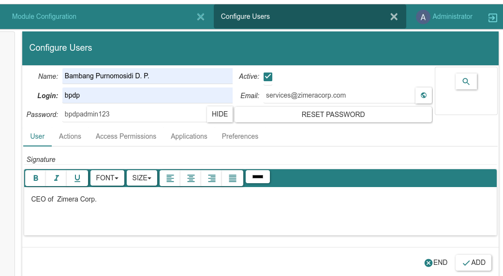

# Zimea ERP - User Guide - Initialization

The first time ZERP runs, the database has been created but the contents are empty. Using this initialization part, we can populate the basic settings ready for operational. Run ZERP using this command:

```
$ python bin/trytond -c deploy/example.cfg
15892 139906950596416 [2023-01-03 04:08:51,475] INFO werkzeug WARNING: This is a development server. Do not use it in a production deployment. Use a production WSGI server instead.
 * Running on http://localhost:8000
15892 139906950596416 [2023-01-03 04:08:51,476] INFO werkzeug Press CTRL+C to quit
```

Access http://localhost:8000 using web browser and use administrator password that you've created (in previous part, we use admin:admin). The next steps are explained below.

## Module Configuration

> You will be able to configure your installation depending on the modules you have installed.

Press OK

## Configure Languages

Choose one or more language(s) to be used. You can use <Ctrl - Left Mouse Button Click> to select. Click ``LOAD``. **Module Configuration** will display information about progress (33.333%). Click ``NEXT``.

## Configure Users

> You can now add some users into the system.
> Be careful that the login must be unique.

Click OK. Fill some data about users and click ``ADD``. Click ``END`` if you have finished adding them.



Module configuration will display the progress (66.667%). Click ``NEXT``.

## Configure Modules

> You can now activate additional modules to the system. 

You can use <Ctrl - Left Mouse Button Click> to select one or more module(s), or use <Ctrl - A> if you want to select **all** modules. Click `` ACTIVATE``. A dialog displayed to show the name of all module(s) which will be activated / ``Perform Pending Activation/Update``. Click ``START UPGRADE``.


The process may takes longer if you activate many modules, so please be patient. Wait until it shows:

.

Click ``OK``.

> You will be able to configure your installation depending on the modules you have installed.

Click ``OK``

The left menu will shows many modules which we have already been activated. Click ``OK``.

.

## Configure Company

> You can now add your company into the system.

Click ``OK``.

In the meantime, just fill the minimum part: company name, currency, and timezone. If you fill **Party** and **Currency** while there is no record associated with the inputted text, then it will displays *Search* or *Create*. Choose *Create* to create the new record. You may also use **Search a record** to display dialog where you can create company and currency:


Click ``NEW`` to create a new party - company. Fill the data. You may use **Search for a record** icon to create - for example - country:


Hae a look at [ISO 3166 Country Code](https://en.wikipedia.org/wiki/List_of_ISO_3166_country_codes).

For currency, you may also see [ISO 4217](https://en.wikipedia.org/wiki/ISO_4217) for official code. Here's another list of [country currency codes](https://www.iban.com/currency-codes).

.

Here's the final result:

.

Click ``ADD``. **Module Configuration** will shows a 80% progress. Click ``NEXT``.

## Create ``Chart of Accounts``

> Create Chart of Accounts from Template
> You can now create a chart of account for your company by selecting a chart of account template.

Click ``OK``. Choose template:

.

Click ``CREATE``. A dialog will be displayed to choose where we should assign some accounts:

[!Create minimal COA - assign 1](images/create-minimal-coa-2.png).

Choose ``main expense`` fo default expense account.

.

Click ``CREATE``.

## Done!

.

Click ``OK``. 

Now, we can start to use ZERP for [operational](01-operational.md).


